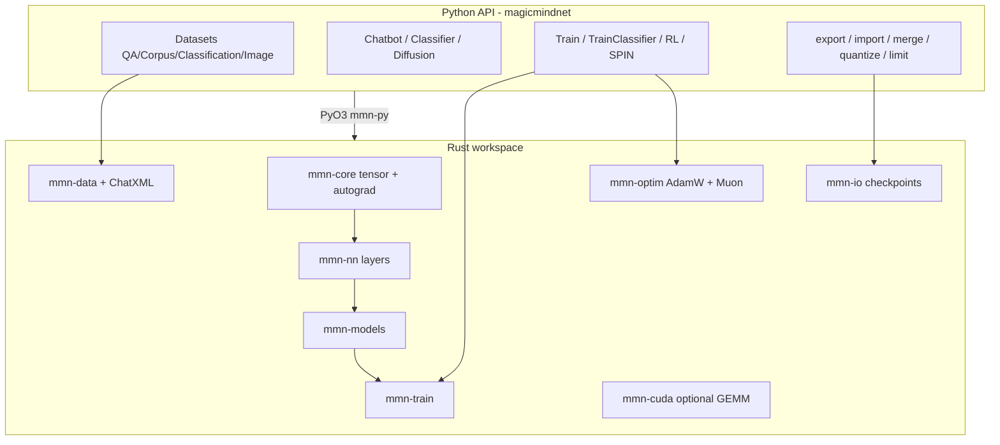

# MagicMindNet

**MagicMindNet** is a high-level Python AI library (`import magicmindnet as ai`) backed by a **from-scratch Rust** workspace: custom tensors and autograd, AdamW + Muon hybrid optimizers, datasets, chatbot training, classification, RL, SPIN, checkpoint IO (export / import / merge / quantize), resource limits, and diffusion building blocks.

Designed for researchers and integrators who want a **small, auditable stack** without pulling in PyTorch or Hugging Face — with strict checkpoint validation so partial or corrupt loads never silently mix random weights.

---

## Table of contents

1. [Quick start](#quick-start)
2. [Architecture](#architecture)
3. [Features at a glance](#features-at-a-glance)
4. [Installation & development](#installation--development)
5. [Python API overview](#python-api-overview)
6. [Checkpoints & strict IO](#checkpoints--strict-io)
7. [Training & examples](#training--examples)
8. [Testing & coverage](#testing--coverage)
9. [CUDA](#cuda)
10. [Project layout](#project-layout)
11. [Documentation index](#documentation-index)
12. [Milestones](#milestones)
13. [License](#license)

---

## Quick start

**Requires:** Python 3.12+, [Rust](https://rustup.rs/), optional CUDA toolkit for GPU matmul.

```bash
pip install maturin pytest
maturin develop --release -m crates/mmn-py/Cargo.toml
pytest -q
python examples/quickstart.py
```

**Full merge gate** (Rust tests, maturin, pytest, ruff, example smoke):

```powershell
.\scripts\verify_gate.ps1
```

Minimal training script:

```python
import magicmindnet as ai

data = ai.DatasetQA(file="qa.json", user_row="input", ai_row="output")
bot = ai.Chatbot(autoset="sub-100M")
cfg = ai.TrainConfig(epochs=1, batch_size=4, cuda=False, optimizer="hybrid")
ai.Train(bot, data, cfg)
ai.export(bot, "safetensors", "bot.mmn")
```

Learned position embeddings (opt-in; adds `pos_embed` to checkpoints):

```python
bot = ai.Chatbot(vocab_size=512, n_layer=2, d_model=64, use_learned_pos_embed=True, max_seq_len=128)
```

See [docs/position_encoding_coverage.md](docs/position_encoding_coverage.md) and `examples/learned_pos_embed_roundtrip.py`.

Classification:

```python
ds = ai.DatasetClassification("labels.json", "text", "tag")
clf = ai.Classifier.from_classification(ds, input_dim=64, seed=42)
ai.TrainClassifier(clf, ds, ai.TrainConfig(epochs=5, batch_size=4, learning_rate=0.05))
ai.export_classifier(clf, "safetensors", "classifier.mmn")
```

---

## Architecture



| Crate | Role |
|-------|------|
| `mmn-core` | `Tensor`, CPU ops, autograd tape, CE / embedding backward |
| `mmn-nn` | `Linear`, `LayerNorm`, GELU, transformer block pieces |
| `mmn-models` | `Chatbot`, `Classifier`, autoset budgets, diffusion stubs |
| `mmn-train` | LM + classifier training loops, RL, SPIN, loss APIs |
| `mmn-io` | Safetensors JSON wrapper, merge, quantize, bin stub |
| `mmn-optim` | AdamW, Newton–Schulz Muon, hybrid optimizer, grad accumulation |
| `mmn-data` | Dataset loaders, ChatXML formatting |
| `mmn-resource` | `limit()` CPU/memory percent parsing |
| `mmn-cuda` | Optional CUDA GEMM parity path |
| `mmn-py` | PyO3 module `magicmindnet` |

---

## Features at a glance

| Area | Capabilities |
|------|----------------|
| **Datasets** | `DatasetQA`, `DatasetCorpus`, `DatasetClassification`, `DatasetImageGen`, `DatasetImageEdit`; ChatXML think-tag split |
| **Chatbot** | Autoset presets (`sub-100M`, `sub-1B`, `sub-10B`), vision flag, seed, shape getters |
| **Classifier** | `from_classification`, `with_labels`, CE training, `predict` probs |
| **Training** | `Train`, `TrainClassifier`, batch accumulation, hybrid AdamW+Muon |
| **RL / SPIN** | Toy alignment loops on small models |
| **IO** | `mmn-safetensors-v1`, `mmn-classifier-v1`, `mmn-bin-v1` stub; **strict import** (no partial load) |
| **Merge** | Element-wise mean of all weights; vision OR; init_seed from first model |
| **Quantize** | `int8` / `int4` on chatbot + classifier weights |
| **Diffusion** | VAE + UNet foundation (structural; not production SD) |
| **Errors** | Typed Python exceptions: `CUDAError`, `DataMismatchError`, `ModelMismatchError`, … |

Known gaps: see [docs/limitations.md](docs/limitations.md) (embedding gather through blocks, HF binary safetensors, full diffusion backward, etc.).

---

## Installation & development

```bash
# Editable Python + dev tools
pip install -e ".[dev]"
maturin develop --release -m crates/mmn-py/Cargo.toml

# Linux/macOS gate scripts
bash scripts/ci_local.sh
bash scripts/verify_gate.sh
```

Windows:

```powershell
.\scripts\ci_local.ps1
.\scripts\lint.ps1
.\scripts\count_tests.ps1
.\scripts\verify_gate.ps1
```

Pre-commit (optional): `.pre-commit-config.yaml` runs ruff on Python sources.

---

## Python API overview

### Datasets

```python
ai.DatasetQA(file, user_row, ai_row)
ai.DatasetCorpus(file, text_row, batch_size=24)
ai.DatasetClassification(file, text_col, label_col)
ai.DatasetImageGen(...)
ai.DatasetImageEdit(...)
```

### Models

```python
ai.Chatbot(vocab_size=..., n_layer=..., d_model=..., seed=..., autoset="sub-100M")
ai.Classifier.from_classification(dataset, input_dim=..., seed=...)
ai.Diffusion(...)  # foundation API
```

### Training config

```python
cfg = ai.TrainConfig(
    epochs=3,
    batch_size=8,
    learning_rate=0.001,
    cuda=False,
    optimizer="hybrid",  # adamw | muon | hybrid
)
ai.Train(bot, dataset, cfg)
ai.TrainClassifier(clf, dataset, cfg)
ai.RL(bot, dataset, cfg)
ai.SPIN(bot, dataset, cfg)
```

### Checkpoint IO

```python
ai.export(bot, "safetensors", path)
bot2 = ai.import_model("safetensors", [path])  # first path only
merged = ai.merge(bot_a, bot_b)
ai.quantize(bot, "int8")  # or "int4"
ai.export_classifier(clf, "safetensors", path)
clf2 = ai.import_classifier("safetensors", [path])
ai.merge_classifier(clf_a, clf_b)
ai.quantize_classifier(clf, "int4")
ai.limit("50%")  # resource cap helper
```

Full API reference: [docs/API.md](docs/API.md).

---

## Checkpoints & strict IO

MagicMindNet uses a **JSON safetensors wrapper** (little-endian F32 blobs), not Hugging Face binary safetensors.

**Strict import guarantees:**

- Required meta: `vocab_size`, `n_layer`, `d_model` (chatbot); `input_dim`, non-empty `labels` (classifier).
- Every exported tensor key must be present; missing keys **fail** (no silent partial load).
- Tensor shapes must match meta-derived expectations (`Linear` layout `[out, in]`).
- Tampered shape tests keep element count equal to data length so validation reaches shape checks.

**100% tensor-key coverage** (missing / shape / merge / quantize for all 12 chatbot keys):

→ [docs/checkpoint_coverage.md](docs/checkpoint_coverage.md)

Format details: [docs/checkpoints.md](docs/checkpoints.md).

---

## Training & examples

| Script | Purpose |
|--------|---------|
| `examples/quickstart.py` | QA load, train, export |
| `examples/benchmark_train.py` | Mean loss before/after train |
| `examples/rl_spin.py` | RL + SPIN on fixture QA |
| `examples/classification_benchmark.py` | Classifier benchmark |
| `examples/classification.py` | Train classifier end-to-end |
| `examples/eval_mean_loss.py` | Mean QA / classification loss |
| `examples/checkpoint_roundtrip.py` | Chatbot export → import |
| `examples/learned_pos_embed_roundtrip.py` | Learned `pos_embed` export → import + loss parity |
| `examples/classifier_roundtrip.py` | Classifier export → import |

Full catalog: [examples/README.md](examples/README.md).

Training notes: [docs/training.md](docs/training.md).

---

## Testing & coverage

After `pip install -e ".[dev]"` and `maturin develop --release`:

| Command | Purpose |
|---------|---------|
| `cargo test --workspace` | Rust unit tests |
| `pytest -q` | Python integration tests |
| `pytest tests/test_io_checkpoint_matrix_py.py -q` | Full chatbot IO contract matrix |
| `.\scripts\ci_local.ps1` | Full local CI gate |
| `.\scripts\verify_gate.ps1` | CI + test count sanity check |

**Current counts** (run `.\scripts\count_tests.ps1` after changes):

- Rust `#[test]`: **214**
- pytest: **489**

Test area map: [docs/testing.md](docs/testing.md).

Deep review artifacts: [docs/reviews/](docs/reviews/).

Subagent for IO gap scans: `.cursor/agents/magicmindnet-checkpoint-strict.md`.

---

## CUDA

Build with CUDA when toolkit is installed:

```bash
maturin develop --features cuda -m crates/mmn-py/Cargo.toml
```

Without CUDA, `TrainConfig(cuda=True)` raises `CUDAError` with fix guidance. CPU path uses reference GEMM in `mmn-core`.

---

## Project layout

```
MagicMindNet/
├── crates/           # Rust workspace (mmn-core … mmn-py)
├── magicmindnet/     # Python package stub / re-exports
├── tests/            # pytest integration + IO matrix
├── examples/         # Runnable demos
├── docs/             # API, training, checkpoints, coverage, reviews
├── scripts/          # ci_local, verify_gate, count_tests, lint
├── .cursor/agents/   # Project subagents (CI, IO, train, …)
├── pyproject.toml
├── CONTRIBUTING.md
├── AGENTS.md
└── CHANGELOG.md
```

---

## Documentation index

| Doc | Contents |
|-----|----------|
| [docs/API.md](docs/API.md) | Public Python surface |
| [docs/training.md](docs/training.md) | Losses, optimizers, batching |
| [docs/training_coverage.md](docs/training_coverage.md) | **Training regression matrix** |
| [docs/vision_coverage.md](docs/vision_coverage.md) | Vision-flag chatbot IO/train path |
| [docs/examples_coverage.md](docs/examples_coverage.md) | **Examples smoke matrix** |
| [docs/attention_coverage.md](docs/attention_coverage.md) | Attention forward/train scope (alpha) |
| [docs/layernorm_coverage.md](docs/layernorm_coverage.md) | LayerNorm forward/train scope (alpha) |
| [docs/nn_coverage.md](docs/nn_coverage.md) | `mmn-nn` block unit tests |
| [docs/quantize_coverage.md](docs/quantize_coverage.md) | int8/int4 quantize regression matrix |
| [docs/dataset_coverage.md](docs/dataset_coverage.md) | **Dataset loader regression matrix** |
| [docs/checkpoints.md](docs/checkpoints.md) | Formats, merge, quantize |
| [docs/checkpoint_coverage.md](docs/checkpoint_coverage.md) | **100% IO regression matrix** |
| [docs/limitations.md](docs/limitations.md) | Known gaps |
| [docs/testing.md](docs/testing.md) | How to run tests |
| [CONTRIBUTING.md](CONTRIBUTING.md) | PR / gate expectations |
| [AGENTS.md](AGENTS.md) | Agent workflow notes |
| [CHANGELOG.md](CHANGELOG.md) | Release history |

---

## Milestones

| Milestone | Status |
|-----------|--------|
| M0 Bootstrap | Done |
| M1 Tensor / autograd / CUDA hooks | Done |
| M2 AdamW + Muon | Done |
| M3 Datasets + ChatXML | Done |
| M4 Chatbot + Train | Done |
| M5 Classification + vision flag | Done |
| M6 IO / merge / quantize / limit | Done |
| M7 RL + SPIN | Done |
| M8–M9 Diffusion / latent pipeline | Foundation (VAE + UNet stubs) |
| M10 Release hardening | CI + strict IO tests + coverage matrix |

---

## License

GPL-3.0-or-later — see [LICENSE](LICENSE).
