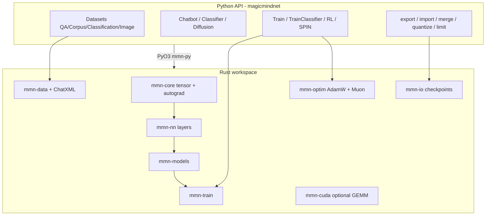

# MagicMindNet

**MagicMindNet** is a beginner-friendly Python AI library (`import magicmindnet as ai`) backed by a **from-scratch Rust** core. Train real transformer chatbots, text classifiers, and toy diffusion models on your own machine — no PyTorch, no Hugging Face, no GPU required — and read every line of the stack that made it happen.

```python
import magicmindnet as ai

data = ai.DatasetQA(data=[
    {"input": "hi", "output": "hello there!"},
    {"input": "how are you?", "output": "doing great, thanks!"},
])
bot = ai.Chatbot(vocab_size=512, n_layer=2, d_model=64, seed=42)
bot.train(data, epochs=5, verbose=True)   # prints per-epoch loss, returns loss history
print(bot.chat("hi"))

bot.save("my_bot.mmn")
bot = ai.load("my_bot.mmn")               # loads any MagicMindNet checkpoint
```

Under the hood: custom tensors and autograd, AdamW + Muon hybrid optimizers, KV-cache generation with modern sampling (top-p/top-k/min-p, penalties), BPE/unigram tokenizers, RoPE/learned/sinusoidal position encodings, GQA attention, vision-prefix multimodal input, RL + SPIN loops, strict checkpoint IO (export / import / merge / quantize), and HF-safetensors interchange.

**New to the library? Start with [docs/getting_started.md](docs/getting_started.md)** and `python examples/hello_ai.py`.

---

## Table of contents

1. [Quick start](#quick-start)
2. [Architecture](#architecture)
3. [Features at a glance](#features-at-a-glance)
4. [Installation & development](#installation--development)
5. [Python API overview](#python-api-overview)
6. [Checkpoints & strict IO](#checkpoints--strict-io)
7. [Training & examples](#training--examples)
8. [Testing & coverage](#testing--coverage)
9. [CUDA](#cuda)
10. [Project layout](#project-layout)
11. [Documentation index](#documentation-index)
12. [Milestones](#milestones)
13. [License](#license)

---

## Quick start

**Requires:** Python 3.12+, [Rust](https://rustup.rs/), optional CUDA toolkit for GPU matmul.

```bash
python -m venv .venv && source .venv/bin/activate
pip install -e ".[dev]"
maturin develop --release
python examples/hello_ai.py
pytest -q
```

**Full merge gate** (Rust tests, maturin, pytest, ruff, example smoke):

```bash
bash scripts/verify_gate.sh        # Windows: .\scripts\verify_gate.ps1
```

Everything is also available function-style for scripting pipelines:

```python
data = ai.DatasetQA(file="qa.json", user_row="input", ai_row="output")
bot = ai.Chatbot(autoset="sub-100M")
cfg = ai.TrainConfig(epochs=1, batch_size=4, cuda=False, optimizer="hybrid")
losses = ai.Train(bot, data, cfg)          # same engine as bot.train(...)
ai.export(bot, "safetensors", "bot.mmn")
```

Learned position embeddings (opt-in; adds `pos_embed` to checkpoints):

```python
bot = ai.Chatbot(vocab_size=512, n_layer=2, d_model=64, use_learned_pos_embed=True, max_seq_len=128)
```

See [docs/position_encoding_coverage.md](docs/position_encoding_coverage.md), `examples/learned_pos_embed_roundtrip.py`, and `examples/rope_roundtrip.py`.

Classification:

```python
ds = ai.DatasetClassification(data=[
    {"text": "sunny warm", "label": "nice"},
    {"text": "rainy cold", "label": "gloomy"},
])
clf = ai.Classifier.from_classification(ds, input_dim=64, seed=42)
clf.train(ds, epochs=20)
print(clf.predict_label("sunny warm"))    # -> "nice"
clf.save("classifier.mmn")
```

---

## Architecture


```mermaid
flowchart TB
    subgraph python [Python API - magicmindnet]
        Datasets[Datasets QA/Corpus/Classification/Image]
        Models[Chatbot / Classifier / Diffusion]
        Train[Train / TrainClassifier / RL / SPIN]
        IO[export / import / merge / quantize / limit]
    end
    subgraph rust [Rust workspace]
        Core[mmn-core tensor + autograd]
        NN[mmn-nn layers]
        ModelsR[mmn-models]
        TrainR[mmn-train]
        IO_R[mmn-io checkpoints]
        Optim[mmn-optim AdamW + Muon]
        Data[mmn-data + ChatXML]
        CUDA[mmn-cuda optional GEMM]
    end
    python -->|PyO3 mmn-py| rust
    Core --> NN --> ModelsR --> TrainR
    IO --> IO_R
    Train --> TrainR
    Train --> Optim
    Datasets --> Data
```

| Crate | Role |
|-------|------|
| `mmn-core` | `Tensor`, CPU ops, autograd tape, CE / embedding backward |
| `mmn-nn` | `Linear`, `LayerNorm`, GELU, transformer block pieces |
| `mmn-models` | `Chatbot`, `Classifier`, `Diffusion` (VAE + UNet training/sampling) |
| `mmn-train` | LM + classifier training loops, RL, SPIN, loss APIs |
| `mmn-io` | Safetensors JSON wrapper, merge, quantize, bin stub |
| `mmn-optim` | AdamW, Newton–Schulz Muon, hybrid optimizer, grad accumulation |
| `mmn-data` | Dataset loaders, ChatXML formatting |
| `mmn-resource` | `limit()` CPU/memory percent parsing |
| `mmn-cuda` | Optional CUDA GEMM parity path |
| `mmn-py` | PyO3 module `magicmindnet` |

---

## Features at a glance

| Area | Capabilities |
|------|----------------|
| **Datasets** | `DatasetQA`, `DatasetCorpus`, `DatasetClassification`, `DatasetImageGen`, `DatasetImageEdit`; **in-memory `data=[...]` lists**; ChatXML think-tag split |
| **Chatbot** | `bot.train` / `bot.chat` / `bot.save` / `Chatbot.load`; autoset presets (`sub-100M`, `sub-1B`, `sub-10B`), vision flag, seed, shape getters |
| **Classifier** | `from_classification`, `with_labels`, `clf.train`, `predict` probs, `predict_label` |
| **Training** | `Train`, `TrainClassifier`, `TrainDiffusion` all return per-epoch loss history; `verbose=True` progress; batch accumulation; `adamw` / `muon` / `hybrid` optimizers (typos raise `ValueError`) |
| **Generation** | KV cache, top-k/top-p/min-p, repetition/frequency/presence penalties, stop strings, sliding context |
| **RL / SPIN** | Toy alignment loops on small models |
| **IO** | Universal `ai.load(path)` auto-detects model family + format; `mmn-safetensors-v1`, `mmn-hf-safetensors-v1` (binary HF Chatbot), `mmn-hf-classifier-v1`, `mmn-classifier-v1`, `mmn-bin-v1` stub; **strict import** |
| **Global formats** | **Zero format libraries anywhere** (safetensors container included — from scratch). **GGUF**: reads every current GGML tensor type, encodes classic quants byte-identical to the reference plus the **complete k-quant family Q2_K–Q6_K + Q8_K** (the reference Python package can't encode k-quants at all), cross-validated against llama.cpp's `gguf` package; embedded SentencePiece and gpt2 byte-BPE tokenizers. **PyTorch** zip + legacy `.pt` + sharded `*.index.json`. **NumPy `.npy`/`.npz`** with from-scratch DEFLATE both ways. **TensorFlow**: Keras `.h5`/`.keras` and checkpoint v2, read AND write — h5py and `tf.train.load_checkpoint` open our output. **ONNX** read + write (passes `onnx.checker`). **Flax/JAX** msgpack pytrees read + write (from-scratch MessagePack codec). Generic `.safetensors` arrays in every spec dtype. Official `safetensors` package opens our containers — [docs/interop.md](docs/interop.md) |
| **Merge** | Element-wise mean of all weights; vision OR; init_seed from first model |
| **Quantize** | `int8` / `int4` on chatbot + classifier weights |
| **Diffusion** | VAE encode/decode, UNet denoise training, inpainting, sampling, checkpoint IO |
| **Errors** | Typed Python exceptions: `CUDAError`, `DataMismatchError`, `ModelMismatchError`, …; constructor typos raise `ValueError` with the valid options |
| **Typing** | Ships `py.typed` + full `.pyi` stubs — IDE autocomplete for the whole API |

Known gaps: see [docs/limitations.md](docs/limitations.md) (external HF model import, full diffusion backward, etc.).

---

## Installation & development

```bash
# Editable Python + dev tools
pip install -e ".[dev]"
maturin develop --release -m crates/mmn-py/Cargo.toml

# Linux/macOS gate scripts
bash scripts/ci_local.sh
bash scripts/verify_gate.sh
```

Windows:

```powershell
.\scripts\ci_local.ps1
.\scripts\lint.ps1
.\scripts\count_tests.ps1
.\scripts\verify_gate.ps1
```

Pre-commit (optional): `.pre-commit-config.yaml` runs ruff on Python sources.

---

## Python API overview

### Datasets

```python
ai.DatasetQA(file="qa.json", user_row="input", ai_row="output")
ai.DatasetQA(data=[{"input": "hi", "output": "hello"}])       # no file needed
ai.DatasetCorpus(rowfile="rows.json", txtfile="corpus.txt")
ai.DatasetCorpus(data=["a chunk of text", "another chunk"])
ai.DatasetClassification(file="labels.json", text_col="text", tags_col="tag")
ai.DatasetClassification(data=[{"text": "yay", "label": "pos"}])
ai.DatasetImageGen("manifest.json")
ai.DatasetImageEdit("edit_manifest.json")
```

### Models

```python
bot = ai.Chatbot(vocab_size=..., n_layer=..., d_model=..., seed=..., autoset="sub-100M")
clf = ai.Classifier.from_classification(dataset, input_dim=..., seed=...)
diff = ai.Diffusion()

# Every model has the same four core methods:
model.train(dataset, epochs=..., learning_rate=..., verbose=True)  # -> list of epoch losses
model.save("model.mmn")
Model.load("model.mmn")     # or the universal ai.load("model.mmn")
bot.chat("hello")           # chatbot only; clf.predict_label(text) for classifiers
```

### Training config

```python
cfg = ai.TrainConfig(
    epochs=3,
    batch_size=8,
    learning_rate=0.001,
    cuda=False,
    optimizer="hybrid",  # "adamw" | "muon" | "hybrid" — anything else raises ValueError
    verbose=False,       # True prints per-epoch mean loss
)
losses = ai.Train(bot, dataset, cfg)             # returns per-epoch mean losses
losses = ai.TrainClassifier(clf, dataset, cfg)
losses = ai.TrainDiffusion(diff, dataset, cfg)
ai.RL(bot, dataset, cfg, reward_amount=1.0, punishment_amount=0.5)
ai.SPIN(bot, selfplay_epochs=2, dataset=dataset)
```

### Checkpoint IO

```python
model = ai.load(path)      # universal: Chatbot / Classifier / Diffusion, any format
                           # (.mmn / .safetensors / .gguf / .pt / .npz — detected by content)

ai.export(bot, "safetensors", path)
bot2 = ai.import_model("safetensors", [path])  # first path only
bot.save("bot.gguf", format="gguf")            # also "gguf-q8_0", "npz", "pt"
merged = ai.merge(bot_a, bot_b)
ai.quantize(bot, "int8")  # or "int4"
ai.export_classifier(clf, "safetensors", path)
clf2 = ai.import_classifier("safetensors", [path])
ai.merge_classifier(clf_a, clf_b)
ai.quantize_classifier(clf, "int4")
ai.limit("50%")  # resource cap helper

# Generic array IO — no numpy/torch/h5py required (but their arrays are accepted)
ai.save_npz("arrays.npz", {"w": [[1.0, 2.0]]})
ai.save_pt("arrays.pt", {"w": [[1.0, 2.0]]})   # torch.load-compatible
weights = ai.load_h5("model.weights.h5")       # HDF5 / Keras without h5py
info = ai.gguf_info("model.gguf")              # GGUF metadata, header-only read
tok = ai.load_gguf_tokenizer("model.gguf")     # embedded SentencePiece vocab
```

Full API reference: [docs/API.md](docs/API.md). Beginner tutorial: [docs/getting_started.md](docs/getting_started.md).

---

## Checkpoints & strict IO

MagicMindNet checkpoints: JSON `mmn-safetensors-v1` / `mmn-classifier-v1` (default) or binary `mmn-hf-safetensors-v1` / `mmn-hf-classifier-v1` (Hugging Face tooling compatible).

**Strict import guarantees:**

- Required meta: `vocab_size`, `n_layer`, `d_model` (chatbot); `input_dim`, non-empty `labels` (classifier).
- Every exported tensor key must be present; missing keys **fail** (no silent partial load).
- Tensor shapes must match meta-derived expectations (`Linear` layout `[out, in]`).
- Tampered shape tests keep element count equal to data length so validation reaches shape checks.

**100% tensor-key coverage** (missing / shape / merge / quantize for all 12 chatbot keys):

→ [docs/checkpoint_coverage.md](docs/checkpoint_coverage.md)

Format details: [docs/checkpoints.md](docs/checkpoints.md).

---

## Training & examples

| Script | Purpose |
|--------|---------|
| `examples/hello_ai.py` | **Start here**: in-memory data, `bot.train`, `bot.chat`, save/`ai.load` |
| `examples/quickstart.py` | QA load, train, export |
| `examples/benchmark_train.py` | Mean loss before/after train |
| `examples/rl_spin.py` | RL + SPIN on fixture QA |
| `examples/classification_benchmark.py` | Classifier benchmark |
| `examples/classification.py` | Train classifier end-to-end |
| `examples/eval_mean_loss.py` | Mean QA / classification loss |
| `examples/checkpoint_roundtrip.py` | Chatbot export → import |
| `examples/learned_pos_embed_roundtrip.py` | Learned `pos_embed` export → import + loss parity |
| `examples/rope_roundtrip.py` | RoPE chatbot export → import + loss parity |
| `examples/classifier_roundtrip.py` | Classifier export → import |

Full catalog: [examples/README.md](examples/README.md).

Training notes: [docs/training.md](docs/training.md).

---

## Testing & coverage

After `pip install -e ".[dev]"` and `maturin develop --release`:

| Command | Purpose |
|---------|---------|
| `cargo test --workspace` | Rust unit tests |
| `pytest -q` | Python integration tests |
| `pytest tests/test_io_checkpoint_matrix_py.py -q` | Full chatbot IO contract matrix |
| `.\scripts\ci_local.ps1` | Full local CI gate |
| `.\scripts\verify_gate.ps1` | CI + test count sanity check |

**Current counts** (run `.\scripts\count_tests.ps1` after changes):

- Rust `#[test]`: **520**
- pytest: **930**

Test area map: [docs/testing.md](docs/testing.md).

Deep review artifacts: [docs/reviews/](docs/reviews/).

Subagent for IO gap scans: `.cursor/agents/magicmindnet-checkpoint-strict.md`.

---

## CUDA

Build with CUDA when toolkit is installed:

```bash
maturin develop --features cuda -m crates/mmn-py/Cargo.toml
```

Without CUDA, `TrainConfig(cuda=True)` raises `CUDAError` with fix guidance. CPU path uses reference GEMM in `mmn-core`.

---

## Project layout

```
MagicMindNet/
├── crates/           # Rust workspace (mmn-core … mmn-py)
├── magicmindnet/     # Python package stub / re-exports
├── tests/            # pytest integration + IO matrix
├── examples/         # Runnable demos
├── docs/             # API, training, checkpoints, coverage, reviews
├── scripts/          # ci_local, verify_gate, count_tests, lint
├── .cursor/agents/   # Project subagents (CI, IO, train, …)
├── pyproject.toml
├── CONTRIBUTING.md
├── AGENTS.md
└── CHANGELOG.md
```

---

## Documentation index

| Doc | Contents |
|-----|----------|
| [docs/getting_started.md](docs/getting_started.md) | **Beginner tutorial** — install to first trained model |
| [docs/API.md](docs/API.md) | Public Python surface |
| [docs/training.md](docs/training.md) | Losses, optimizers, batching |
| [docs/training_coverage.md](docs/training_coverage.md) | **Training regression matrix** |
| [docs/vision_coverage.md](docs/vision_coverage.md) | Vision-flag chatbot IO/train path |
| [docs/examples_coverage.md](docs/examples_coverage.md) | **Examples smoke matrix** |
| [docs/attention_coverage.md](docs/attention_coverage.md) | Attention forward/train scope (alpha) |
| [docs/layernorm_coverage.md](docs/layernorm_coverage.md) | LayerNorm forward/train scope (alpha) |
| [docs/nn_coverage.md](docs/nn_coverage.md) | `mmn-nn` block unit tests |
| [docs/quantize_coverage.md](docs/quantize_coverage.md) | int8/int4 quantize regression matrix |
| [docs/dataset_coverage.md](docs/dataset_coverage.md) | **Dataset loader regression matrix** |
| [docs/checkpoints.md](docs/checkpoints.md) | Formats, merge, quantize |
| [docs/checkpoint_coverage.md](docs/checkpoint_coverage.md) | **100% IO regression matrix** |
| [docs/limitations.md](docs/limitations.md) | Known gaps |
| [docs/testing.md](docs/testing.md) | How to run tests |
| [CONTRIBUTING.md](CONTRIBUTING.md) | PR / gate expectations |
| [AGENTS.md](AGENTS.md) | Agent workflow notes |
| [CHANGELOG.md](CHANGELOG.md) | Release history |

---

## Milestones

| Milestone | Status |
|-----------|--------|
| M0 Bootstrap | Done |
| M1 Tensor / autograd / CUDA hooks | Done |
| M2 AdamW + Muon | Done |
| M3 Datasets + ChatXML | Done |
| M4 Chatbot + Train | Done |
| M5 Classification + vision flag | Done |
| M6 IO / merge / quantize / limit | Done |
| M7 RL + SPIN | Done |
| M8–M9 Diffusion / latent pipeline | TrainDiffusion, inpainting, sample/export/merge/quantize |
| M10 Release hardening | CI + strict IO tests + coverage matrix |

---

## License

GPL-3.0-or-later — see [LICENSE](LICENSE).
